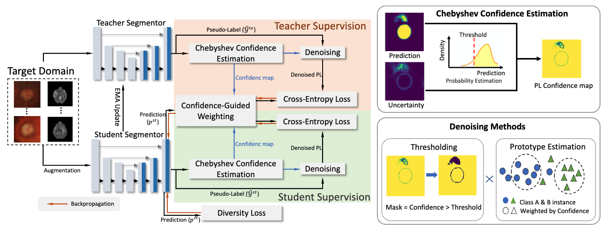

# SFDA-Chebyshev

## Introduction
Pytorch implementation of paper "A Chebyshev Confidence Guided Source-Free Domain Adaptation Framework for Medical Image Segmentation". This paper is accepted by Journal of Biomedical and Health Informatics (JBHI).  

In this paper, we propose a method for evaluating the confidence of pseudo-labels and a corresponding efficient Source-Free Domain Adaptation (SFDA) framework evaluated in medical images.
<div align="center">
   <br>
</div>

## Try the Demo!
It's very easy to try our demo, all you need is pytorch and numpy installed.  
We provide you with a plug and play function to generate the Chebyshev confidence map.  
See **Demo.ipynb**.  
  
If you want to run the entire pipeline, see below.
## Requirements
Use the following commands to create and activate the necessary environment:

```bash
conda create -n SFDACheby python=3.8
conda activate SFDACheby

pip install -r requirements.txt
```

## Download datasets
Preprocessed multisite prostate dataset can be found [here](https://drive.google.com/file/d/13RXF4wfyjRpWkl3Xu14MVf_QP8BPMfVZ/view?usp=share_link).

## Apply on customized dataset
Will be updated soon.

## Getting Started
Train the model with data from source domain.
```
python train_source.py --datasetS Domain_source --data-dir /dataset_path
```
Adapt to the target domain.
```
python adapt_to_target.py --target Domain_target --data-dir /dataset_path --model-file /checkpoint_path.pth.tar
```

## Acknowledgements
This repository benefits from the excellent work provided by [SFDA-DPL](https://github.com/cchen-cc/SFDA-DPL).
